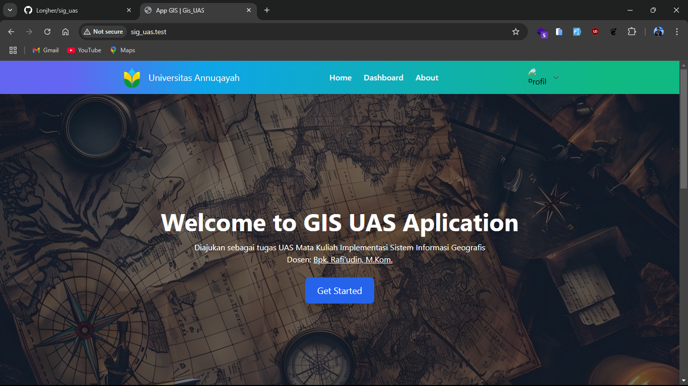
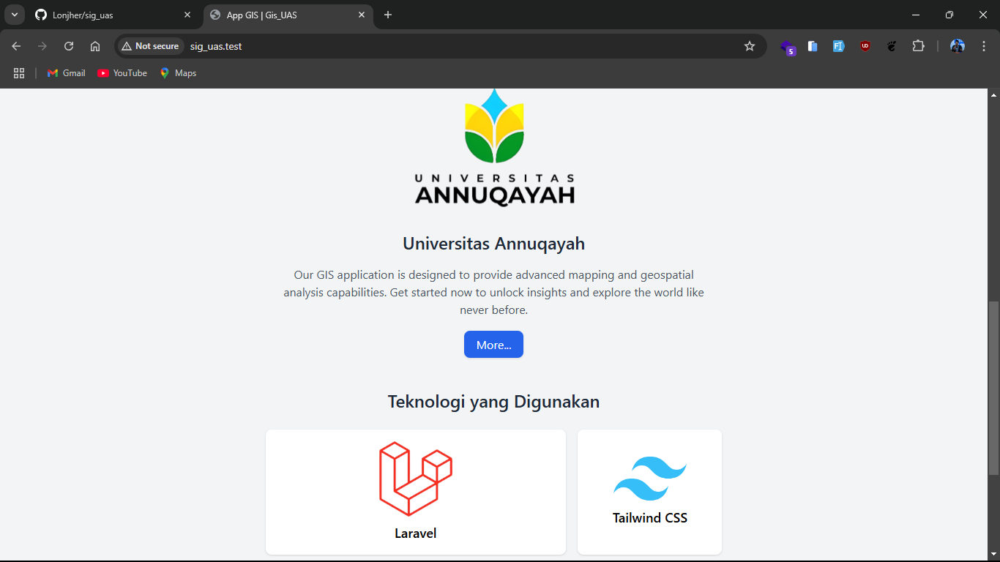
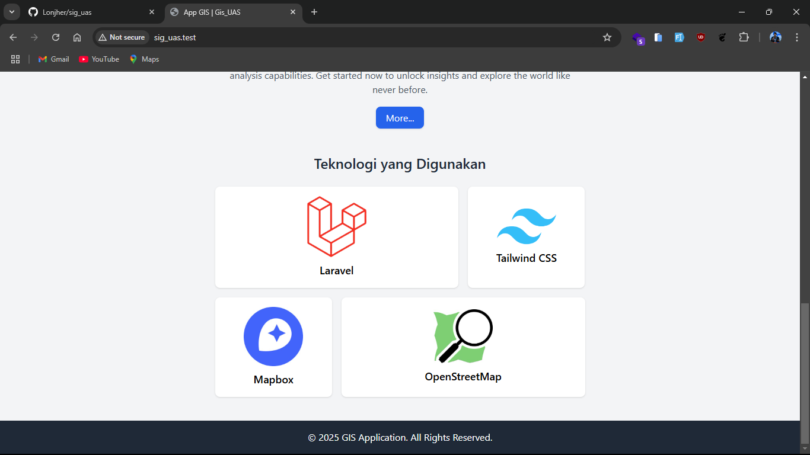
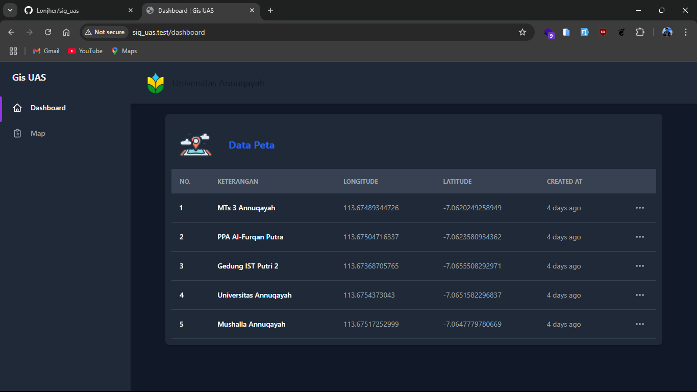

## About This Project

Proyek ini diajukan sebagai tugas Mata Kuliah Implementasi Sistem Informasi Geografis (SIG) Semester VII Universitas Annuqayah. Proyek ini berupa aplikasi sederhana dari implemtasi SIG dengan beberapa capability salah satunya:

- [Menambahkan marker](https://laravel.com/docs/routing).
- [Menentukan marker pada peta](https://laravel.com/docs/container).
- Menambahkan data [Polygon](https://id.wikipedia.org/wiki/Poligon) walaupun berupa data statis.
- Implementasi [Livewire](https://livewire.laravel.com/).
- Integrasi dengan [MapBox](https://www.mapbox.com/).
- Menggunakan Framework CSS [TailwindCss](https://tailwindcss.com/).

Semuanya tercover dalam sebuah framework pengembangan Website [Laravel](https://laravel.com).

## Dokumentasi Proyek

### Halaman Utama

### Halaman Deskripsi Proyek

### Teknologi yang digunakan

### Halaman Peta

### Instalasi

- **Clone repository ini:**
  
git clone https://github.com/lonjher/sig_uas.git

- **Masuk ke direktori proyek:**
  
cd sig_uas

- **Salin file .env.example menjadi .env:**
  
cp .env.example .env

- **Buat Key:**
  
php artisan key:generate

- **Instal dependensi dengan Composer dan NPM:**
  <ul>
      <li>composer install</li>
      <li>npm install</li>
      <li>npm run dev</li>
  </ul>
- **Migrasi dan seeding database:**
  
php artisan migrate --seed

- **Jalankan server pengembangan Laravel:**
  
php artisan serve

## Penggunaan

1. Akses aplikasi melalui browser di 
http://localhost:8000
.
3. Mulai eksplorasi fitur aplikasi.
